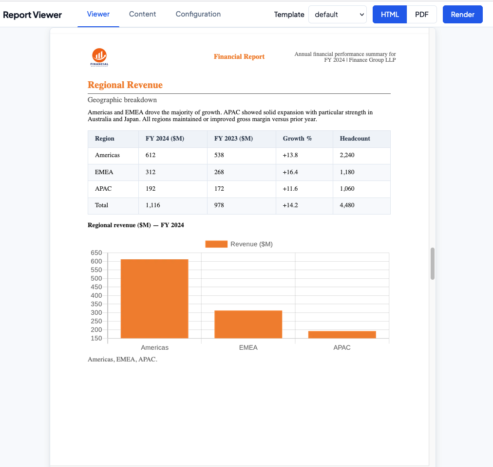

# RB — Report Builder

A report generation service that renders HTML or PDF reports from JSON data using Handlebars templates. It consists of a **NestJS backend API** and an optional **React + Vite viewer** for previewing reports in the browser.

## Example output

Sample screenshots of reports generated by the application:

| Bar chart (quarterly revenue) | Pie chart (segment mix) |
|-------------------------------|--------------------------|
|  |  |

## Generating your own screenshots

1. Start the backend from `backend/`: `npm run start:dev`
2. Generate HTML (from repo root):
   ```bash
   curl -X POST http://localhost:3000/reports/generate?format=html \
     -H "Content-Type: application/json" \
     -d "{\"template\":\"default\",\"content\":$(cat backend/samples/sample-report-financial.json),\"config\":{\"reportTitle\":\"FY 2024 Financial Summary\",\"reportSubtitle\":\"Annual Report\",\"companyName\":\"Acme Corp\",\"footer\":\"Confidential — FY 2024\"},\"options\":{\"paged\":false}}" \
     -o docs/financial-report-preview.html
   ```
3. Open `docs/financial-report-preview.html` in a browser and take a screenshot.
4. Save the screenshot in this folder for use in README or other docs.

**Sample used:** `backend/samples/sample-report-financial.json`


## Project structure

```
rb/
├── backend/                 # NestJS API
│   ├── src/
│   │   ├── main.ts
│   │   ├── app.module.ts
│   │   ├── report/          # Report generation (controller, service, DTOs)
│   │   └── template/        # Handlebars template loading & compilation
│   ├── templates/           # Report templates (each subfolder = one template)
│   │   └── default/
│   │       ├── report.hbs   # Main layout
│   │       └── partials/    # Reusable .hbs partials
│   ├── samples/             # Sample JSON payloads for testing
│   ├── nest-cli.json
│   └── package.json
├── client/                  # Optional report viewer (React + Vite)
│   └── package.json
└── package.json             # Root scripts (convenience)
```

- **Backend**: Renders reports from a `template` name + `content` (and optional `config`). Output is HTML or PDF (via Puppeteer). Templates can use Handlebars helpers (e.g. `staticMapUrl`, `chartImageUrl`) and optional paged.js for print-style layout.
- **Client**: Dev UI to preview reports; uses paged.js for pagination in the browser.

## Prerequisites

- **Node.js** (v18+)
- For PDF generation, the backend uses **Puppeteer** (headless Chrome); no extra install needed beyond `npm install`.

## Setup

### Backend (API)

```bash
cd backend
npm install
```

Optional env (create `backend/.env` if needed):

- `PORT` — server port (default: `3000`)
- `TEMPLATES_PATH` — absolute path to templates directory (default: `backend/templates` when run from `backend/`)

### Client (viewer)

```bash
cd client
npm install
```

## Run

### Backend

From the **backend** directory:

```bash
cd backend
npm run start:dev
```

API runs at **http://localhost:3000** (or your `PORT`).

### Client (viewer)

From the **client** directory:

```bash
cd client
npm run dev
```

Or from the repo root:

```bash
npm run viewer
```

## API

| Method | Path | Description |
|--------|------|-------------|
| `GET`  | `/reports/templates` | List available template names |
| `POST` | `/reports/generate?format=html\|pdf` | Generate a report |

**POST /reports/generate**

Body (JSON):

```json
{
  "template": "default",
  "content": { ... },
  "config": { ... },
  "options": { "paged": true }
}
```

- `template` — name of a folder under `templates/` (e.g. `default`).
- `content` — data passed to the Handlebars template as `content`.
- `config` — optional; passed as `config` in the template.
- `options.paged` — optional; when true, backend can use paged.js for print-style output.

Query:

- `format` — `html` (default) or `pdf`. For `pdf`, response is a PDF file download.

### Supported content shape (default template)

The default template expects `content` with an optional cover and a list of sections:

| Content field | Type | Description |
|---------------|------|-------------|
| `content.coverImage` | string | Optional. URL of the cover image. |
| `content.coverText` | string | Optional. Paragraph shown on the cover. |
| `content.sections` | array | List of sections (see below). |

Each **section** has:

| Field | Type | Description |
|-------|------|-------------|
| `title` | string | Section heading. |
| `subtitle` | string | Optional. Subheading. |
| `blocks` | array | List of block objects. |

Each **block** must have a `type` and type-specific properties:

| Block type | Properties | Description |
|------------|------------|-------------|
| `text` | `text` (string) | Paragraph. |
| `table` | `headers` (array of strings), `rows` (array of arrays). Optional: `allowPageBreak` (boolean) for tables that can break across pages. | Data table. |
| `image` | `src` (string, URL). Optional: `alt`, `caption`. | Image figure. |
| `graph` | Either `src` (image URL) or `chart` (Chart.js config for QuickChart). Optional: `title`, `caption`, `width`, `height`. In `chart`, use `"primary"` / `"secondary"` for colors; they are replaced by `config.primaryColor` / `config.secondaryColor`. | Chart (rendered via QuickChart or image URL). |
| `map` | Requires `config.googleMapsApiKey`. Use `center` (lat,lng array or string) and optional `zoom`, `size`, `markers` (array of `{ lat, lng, label?, color? }`). | Static map image (Google Static Maps API). |

**Example block (text):** `{ "type": "text", "text": "Lorem ipsum." }`  
**Example block (table):** `{ "type": "table", "headers": ["A", "B"], "rows": [["1", "2"]] }`  
**Example block (graph with chart):** `{ "type": "graph", "title": "Revenue", "chart": { "type": "bar", "data": { "labels": ["Q1"], "datasets": [{ "data": [100], "backgroundColor": "primary" }] } }, "width": 640, "height": 280 }`

### Config (default template)

Optional `config` passed to the template can include:

| Config key | Description |
|------------|-------------|
| `reportTitle` | Report title (cover, header, page title). |
| `reportSubtitle` | Subtitle. |
| `companyName` | Company name (cover, header). |
| `logo` | URL of logo image. |
| `footer` | Footer text. |
| `primaryColor`, `secondaryColor` | CSS color (e.g. `#2563eb`). Used in styles and chart helper. |
| `pageSize`, `pageMargin` | Page layout (e.g. `A4`, `24mm`). |
| `headerHeight`, `footerHeight`, `headerPadding`, `bodyPadding` | Layout sizes. |
| `fontFamily`, `fontSize`, `lineHeight` | Typography. |
| `googleMapsApiKey` | Required for `map` blocks (Google Static Maps). |

### Reference sample JSON files

Sample payloads (content only; wrap in `{ "template": "default", "content": <file>, "config": { ... } }` for the API):

| File | Description |
|------|-------------|
| `backend/samples/sample-report-financial.json` | Financial report: executive summary, P&L, segment/regional tables, balance sheet, cash flow, charts (bar, doughnut). |
| `backend/samples/sample-report-large.json` | Large report: executive summary, detailed line-item table (multi-page), regional tables, images. |
| `backend/samples/sample-report-cre-appraisal.json` | CRE appraisal: cover letter, transmittal, table of contents, property and market sections. |

## Building new templates

1. **Create a template folder** under `backend/templates/`, e.g. `backend/templates/my-report/`. The folder name is the template id (e.g. `my-report`).
2. **Add the main layout:** `report.hbs`. It receives `content`, `config`, and `options` (e.g. `options.paged`, `options.coverOnly`, `options.bodyOnly`). Output full HTML (including `<!DOCTYPE html>`, `<head>`, `<body>`).
3. **Optionally add partials:** create `partials/` inside the template folder and add `.hbs` files (e.g. `partials/table-block.hbs`). Partials are auto-loaded; name the file without path (e.g. `table-block` is used as `{{> table-block}}`).
4. **Convention:** The default template uses `report.hbs` as the entry and expects `content.sections` with blocks that have `type` and type-specific fields. Your template can use any `content` and `config` shape; document the expected JSON for your template.
5. **Custom helpers:** Built-in helpers are `eq`, `staticMapUrl` (Google Static Maps), `chartImageUrl` (QuickChart). To add more, edit `backend/src/template/template.service.ts` and register in `getCompiledTemplate` (or a shared method) via `compiler.registerHelper(name, fn)`. Helpers are currently global per compiler instance; template-specific helpers would require a separate compiler per template.
6. **Discovery:** A folder is listed in `GET /reports/templates` only if it contains `report.hbs`. Use `POST /reports/generate` with `"template": "my-report"` to render.

## Build (backend)

```bash
cd backend
npm run build
npm run start:prod
```

Output is in `backend/dist/`; production run uses `node dist/main`.
